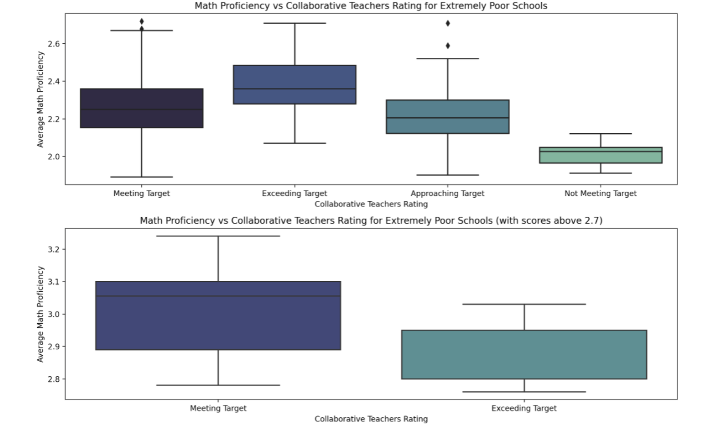
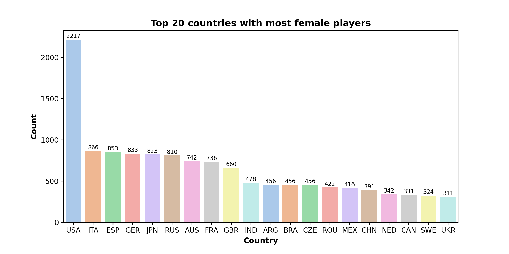
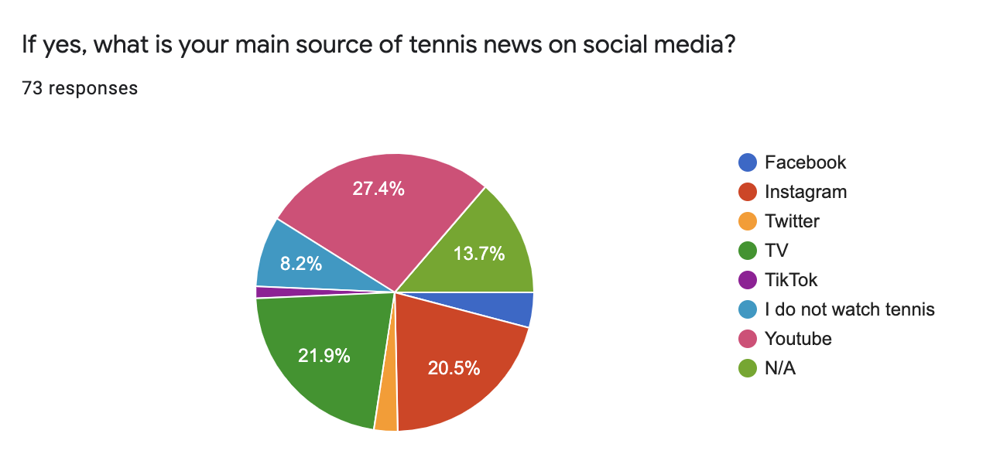

# Portfolio
---

[**Stroke Prediction Classification**](https://github.com/ngocknguyen/Stroke-Prediction-Classification)

 According to WHO, stroke is second leading to death globally. Someone in the United States has a stroke every 40 minutes and dies of a stroke every 4 minutes. Thus, I wanted to predict stroke patients using 12 health factors and to identify factors that have the most influence to cause stroke on patients. The best model could be used by hospital staffs and healthcare professionals to indicate patients who are likely to have stroke and reduce the risk of sending them home. 
 
I performed exploratory data analysis, and different data mining methods including logistic regression, decision tree, and random forest to the dataset to find the best prediction model. I concluded that the best model is the Random Forest model with an accuracy of 99.5%. 
 
Models: Backward selection, Regression Tree, Random Forest.
 

---
[**Women's Clothing Demand Sentiment Analysis**](https://github.com/ngocknguyen/Women-s-Clothing-Review--NLP-Sentiment-Analysis)

 My goal on this project is to understand what customers like and dislike about their purchases. I performed text exploration to observe trends in customers' reviews, find out what is the most positive and most negative words and extract actionable plans to improve its online e-commerce
 

---
[**JP Morgan Data for Good Hackathon: New York City Public Schools**](https://github.com/ngocknguyen/Data-for-Good-JP-Morgan-Hackathon)

 We worked in a team of four members to analyze social good datasets of NYC Public schools. The purpose of this project is to  provide key findings that can enable effective investments in NYC schools, especially with those under-performing schools.
  
We cleaned and wrangled a dataset comprised of seven small data files using Python and Tableau. 
 
Some interesting findings:  
• Student Performance is strongly associated with Economic Need Index  
•Those under-performing schools often have strong correlation with Teacher Performance, School Environment, and Family Relationship
 

---
[**Consulting Project with IPTL**](https://github.com/ngocknguyen/IPTL-Consulting-Project)

 International Professional Tennis League (IPTL) is a start-up company dedicated to making tennis the most profitable and popular sport internationally. IPTL strives to disrupt the current tennis industry by introducing a numeric game format and marketing platform where fans can interact and engage with the sport in real-time. Rather than being focused on an individual competitive sport, IPTL fosters a community.  
We conducted analyses to  
• Gain a deeper understanding of IPTL clients and the overall positioning of IPTL in the larger tennis industry resulting from user survey analyses and secondary market research  
• Identify partnership opportunities for client via research of market of local tennis clubs and organizations  
• Build a marketing plan to raise awareness and further develop content strategy  

---
[**Data Visualization**](https://public.tableau.com/app/profile/ngocknguyen)

---

© 2021 Ngoc Nguyen. Powered by Jekyll and the Minimal Theme.

